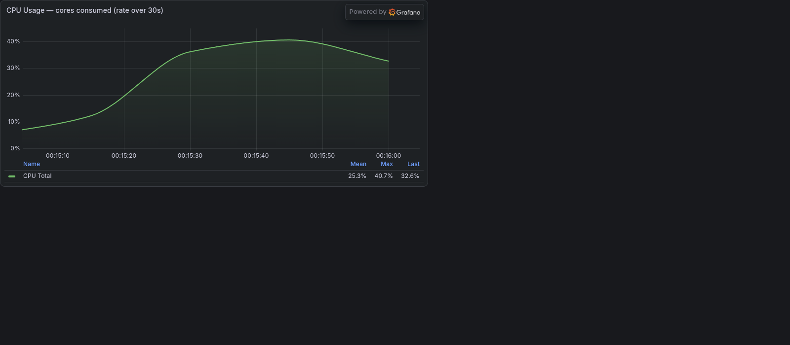
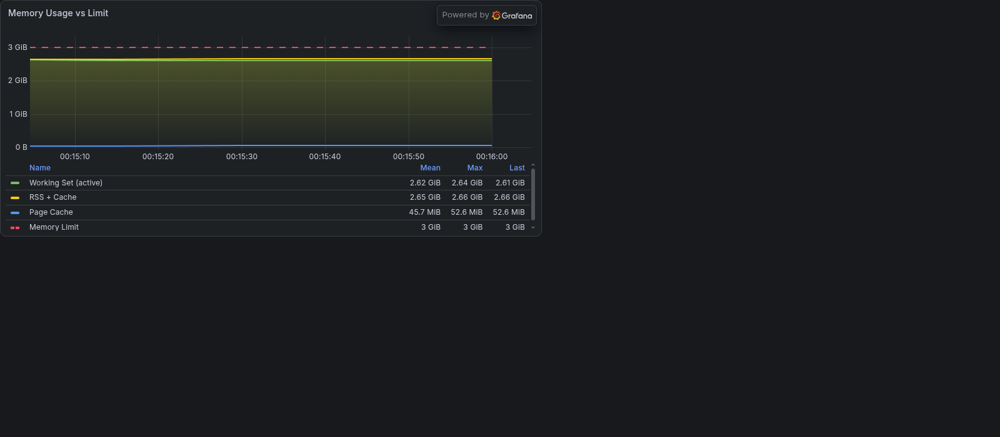
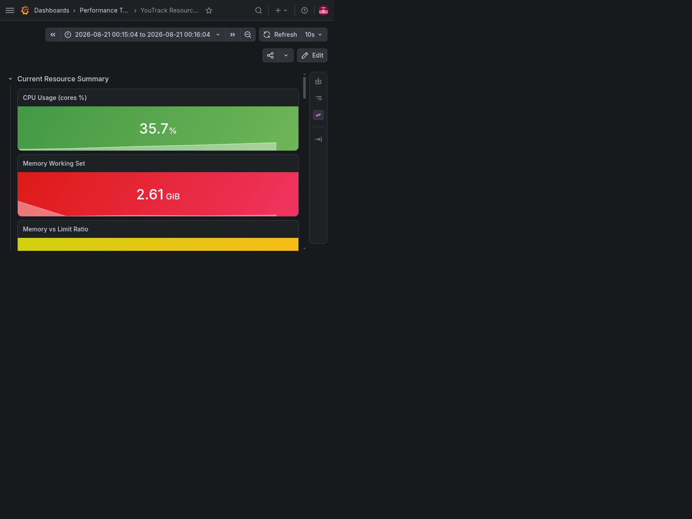
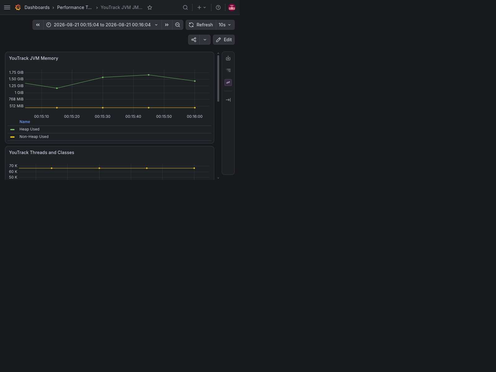
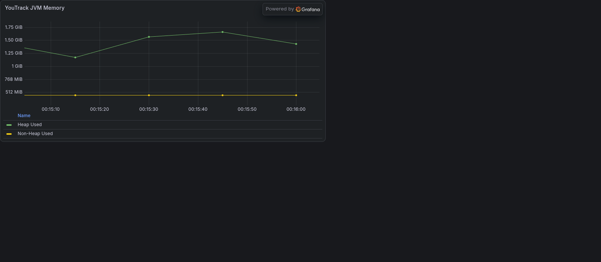
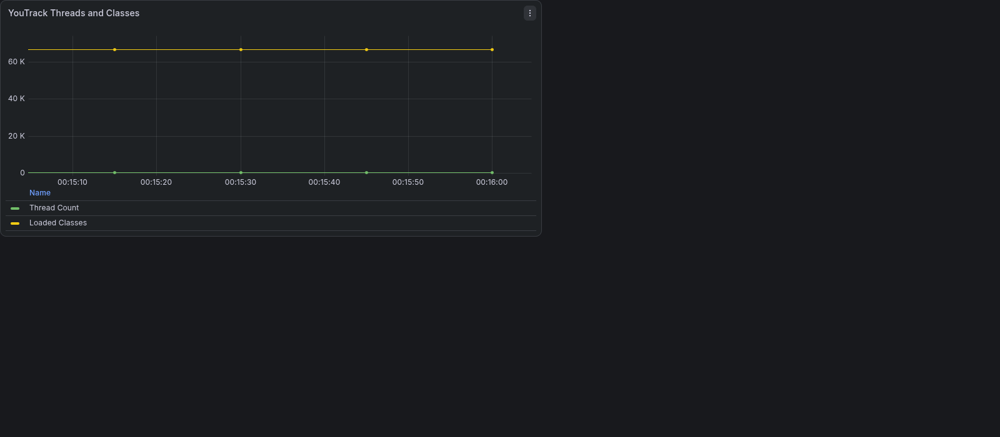

# Performance Test Results
 
## Test Analysis 

The target system sustained 90 requests per minute (RPM), as defined in the [workload profile](../load_profile.xlsx), throughout the 1-minute steady-state load period. Resource utilization remained stable, and response times showed consistent performance with no signs of degradation.

## Test Details

- Combined time window (latest successful runs across all 3 scripts):
	- From (UTC): 2026-08-20T22:15:04.678000+00:00
	- To (UTC): 2026-08-20T22:16:04.705000+00:00
	- Duration: 1.00 minute

## Request graph

Generated by `parse_results.py` from latest simulation logs.

## Request table (transaction aggregation)

Source: `perf_test_scripts/results/parsed/latency_summary.csv` generated by `parse_results.py`.

| Usecase | Transaction | Total | Success | Failed | Error rate % | Avg ms | P50 ms | P90 ms | Min ms | Max ms |
| --- | --- | ---: | ---: | ---: | ---: | ---: | ---: | ---: | ---: | ---: |
| Browse And Write | Create New Issue | 10 | 10 | 0 | 0.00 | 128.40 | 129.00 | 144.60 | 106.00 | 168.00 |
| Browse And Write | List Issues | 24 | 24 | 0 | 0.00 | 60.50 | 49.50 | 83.60 | 13.00 | 250.00 |
| Browse And Write | Open Random Issue | 14 | 14 | 0 | 0.00 | 6.79 | 6.00 | 7.00 | 4.00 | 21.00 |
| Browse And Write | Update Random Field | 14 | 14 | 0 | 0.00 | 58.57 | 46.50 | 105.70 | 28.00 | 112.00 |
| Search | Perform Search | 20 | 20 | 0 | 0.00 | 5.70 | 4.00 | 10.30 | 3.00 | 23.00 |
| View Issue | List Issues | 48 | 48 | 0 | 0.00 | 72.23 | 57.50 | 143.00 | 9.00 | 289.00 |
| View Issue | Open Random Issue | 48 | 48 | 0 | 0.00 | 6.19 | 5.00 | 8.30 | 3.00 | 38.00 |

## Aggregated by script

This is a script-level aggregation of the transaction table above.

| Script | Total | Success | Failed | Error rate % | Avg ms (success-weighted) | P50 ms (success-weighted) | P90 ms (success-weighted) | Max observed ms |
| --- | ---: | ---: | ---: | ---: | ---: | ---: | ---: | ---: |
| Browse And Write | 62 | 62 | 0 | 0.00 | 58.89 | 51.82 | 81.13 | 250.00 |
| Search | 20 | 20 | 0 | 0.00 | 5.70 | 4.00 | 10.30 | 23.00 |
| View Issue | 96 | 96 | 0 | 0.00 | 39.21 | 31.25 | 75.65 | 289.00 |

## Grafana evidence for the same time period

### Dashboard: YouTrack Resource Monitoring

CPU metrics:

Memory metrics:

Average resource consumption during test:

### Dashboard: YouTrack JVM JMX Monitoring

JMX metrics (full dashboard):

JVM memory panel:

JVM threads/classes panel:

