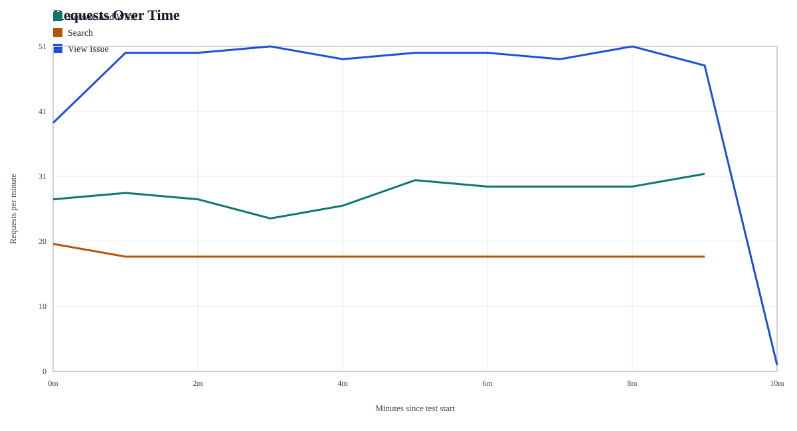
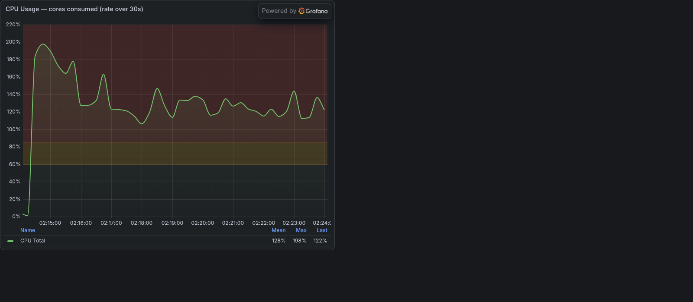
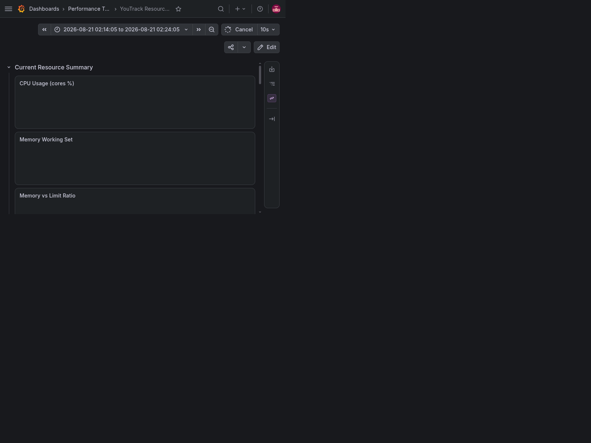
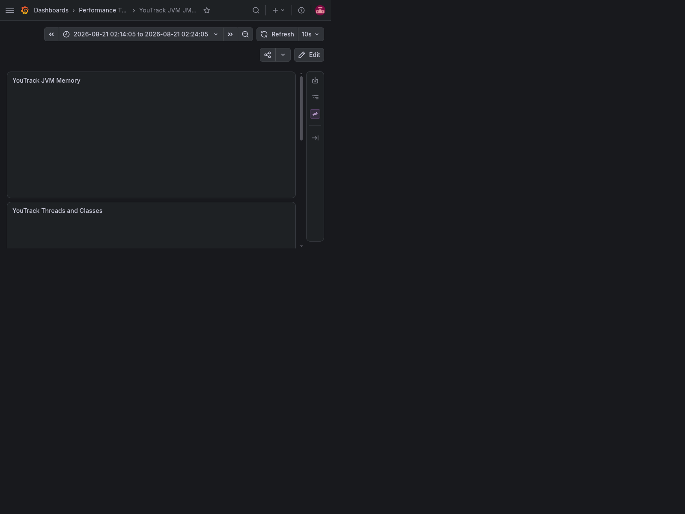

# Performance Test Results

## Test Analysis

This report covers the latest 10-minute run executed according to the bundled [workload profile](load_profile.xlsx). Search traffic remained well within target latency, while both `/api/sortedIssues` list flows exceeded the 500 ms SLO at p90. The issue-open transaction also has a coverage gap in this run, so that SLO is reported as failed due to missing measurement rather than inferred performance.

## Test Details

- Combined time window (UTC): 2026-08-21T00:14:05.924000+00:00 to 2026-08-21T00:24:05.702000+00:00
- Duration: 10.00 minutes
- Source window file: [test_time_range.csv](test_time_range.csv)

## Bundled Test Artifacts

- [latency_summary.csv](latency_summary.csv)
- [requests_over_time.csv](requests_over_time.csv)
- [requests_over_time.svg](requests_over_time.svg)
- [simulation_time_windows.csv](simulation_time_windows.csv)
- [test_time_range.csv](test_time_range.csv)
- [load_profile.xlsx](load_profile.xlsx)

## Request Graph

## Response-Time Table

Source: [latency_summary.csv](latency_summary.csv).

| Usecase | Transaction | Total | Success | Failed | Error rate % | Avg ms | P50 ms | P90 ms | Min ms | Max ms |
| --- | --- | ---: | ---: | ---: | ---: | ---: | ---: | ---: | ---: | ---: |
| Browse And Write | Create New Issue | 69 | 69 | 0 | 0.00 | 311.68 | 229.00 | 501.20 | 130.00 | 1461.00 |
| Browse And Write | List Issues | 211 | 211 | 0 | 0.00 | 1143.21 | 900.00 | 1915.00 | 521.00 | 6486.00 |
| Search | Perform Search | 182 | 182 | 0 | 0.00 | 10.57 | 4.00 | 33.90 | 2.00 | 67.00 |
| View Issue | List Issues | 488 | 488 | 0 | 0.00 | 996.28 | 804.50 | 1645.60 | 520.00 | 6336.00 |

SLO compliance for this run is as follows: `GET /api/issue/{id}?fields=... <= 500 ms` is FAIL because no measured p90 was produced for this run; `POST /api/issuesGetter?fields=... <= 1000 ms` is PASS with measured p90 33.90 ms from `Perform Search`; `GET /api/sortedIssues <= 500 ms` is FAIL because the measured list-call p90 values were 1915.00 ms for `Browse And Write` and 1645.60 ms for `View Issue`, both above the threshold.

## Aggregated By Script

This is a script-level aggregation of the transaction rows above.

| Script | Total | Success | Failed | Error rate % | Avg ms (success-weighted) | P50 ms (success-weighted) | P90 ms (success-weighted) | Max observed ms |
| --- | ---: | ---: | ---: | ---: | ---: | ---: | ---: | ---: |
| Browse And Write | 280 | 280 | 0 | 0.00 | 938.30 | 734.65 | 1566.60 | 6486.00 |
| Search | 182 | 182 | 0 | 0.00 | 10.57 | 4.00 | 33.90 | 67.00 |
| View Issue | 488 | 488 | 0 | 0.00 | 996.28 | 804.50 | 1645.60 | 6336.00 |

## Grafana Evidence

### Dashboard: YouTrack Resource Monitoring

CPU metrics:
(200% means 2 cpus utilized)

Memory metrics:

Full dashboard:

### Dashboard: YouTrack JVM JMX Monitoring

Full dashboard:

JVM memory panel:

JVM threads and classes panel:

