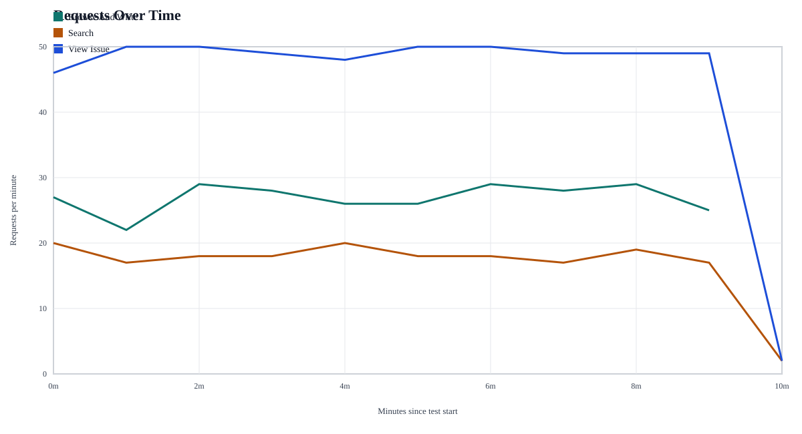
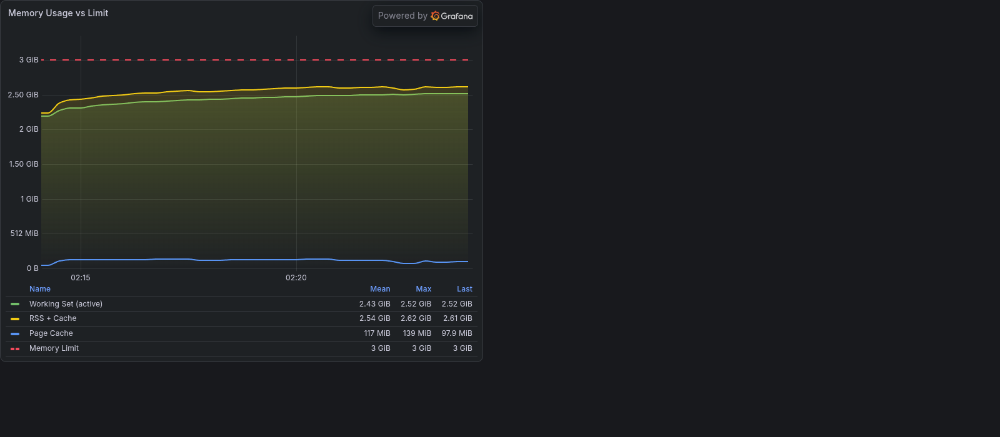
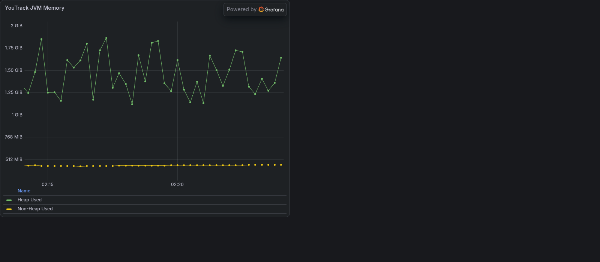
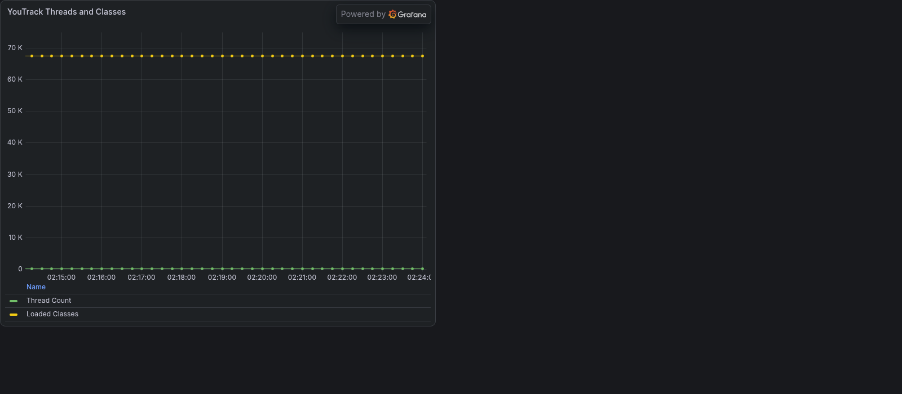

# Performance Test Results

## Test Analysis

This report covers the latest 10-minute run executed according to the bundled [workload profile](load_profile.xlsx). Search traffic remained well within target latency, while both list flows for `/api/sortedIssues` exceeded the 500 ms SLO at p90. The issue-open transaction was not recorded in this run, so that SLO is reported as failed due to missing measurement rather than inferred performance.

## Test Details

- Combined time window (UTC): 2026-08-21T01:20:17.574000+00:00 to 2026-08-21T01:30:17.278000+00:00
- Duration: 10.00 minutes
- Source window file: [test_time_range.csv](test_time_range.csv)

## Bundled Test Artifacts

- [latency_summary.csv](latency_summary.csv)
- [requests_over_time.csv](requests_over_time.csv)
- [requests_over_time.svg](requests_over_time.svg)
- [simulation_time_windows.csv](simulation_time_windows.csv)
- [test_time_range.csv](test_time_range.csv)
- [load_profile.xlsx](load_profile.xlsx)

## Request Graph

## Response-Time Table

Source: [latency_summary.csv](latency_summary.csv).

| Usecase | Transaction | Total | Success | Failed | Error rate % | Avg ms | P50 ms | P90 ms | Min ms | Max ms |
| --- | --- | ---: | ---: | ---: | ---: | ---: | ---: | ---: | ---: | ---: |
| Browse And Write | Create New Issue | 57 | 57 | 0 | 0.00 | 172.51 | 151.00 | 264.60 | 108.00 | 368.00 |
| Browse And Write | List Issues | 212 | 212 | 0 | 0.00 | 741.26 | 655.50 | 1071.90 | 398.00 | 1677.00 |
| Search | Perform Search | 184 | 184 | 0 | 0.00 | 5.55 | 4.00 | 7.00 | 2.00 | 45.00 |
| View Issue | List Issues | 492 | 492 | 0 | 0.00 | 651.78 | 552.00 | 1020.40 | 384.00 | 1809.00 |

SLO compliance for this run is as follows: `GET /api/issue/{id}?fields=... <= 500 ms` is FAIL because no issue-open p90 was measured in this run; `POST /api/issuesGetter?fields=... <= 1000 ms` is PASS with measured p90 7.00 ms from the search transaction; `GET /api/sortedIssues <= 500 ms` is FAIL because the list-call p90 values were 1071.90 ms for Browse And Write and 1020.40 ms for View Issue, both above the threshold.

## Aggregated By Script

This is a script-level aggregation of the transaction rows above.

| Script | Total | Success | Failed | Error rate % | Avg ms (success-weighted) | P50 ms (success-weighted) | P90 ms (success-weighted) | Max observed ms |
| --- | ---: | ---: | ---: | ---: | ---: | ---: | ---: | ---: |
| Browse And Write | 269 | 269 | 0 | 0.00 | 620.74 | 548.60 | 900.84 | 1677.00 |
| Search | 184 | 184 | 0 | 0.00 | 5.55 | 4.00 | 7.00 | 45.00 |
| View Issue | 492 | 492 | 0 | 0.00 | 651.78 | 552.00 | 1020.40 | 1809.00 |

## Grafana Evidence

### Dashboard: YouTrack Resource Monitoring

CPU metrics:

Memory metrics:

JVM memory panel:

JVM threads and classes panel:

